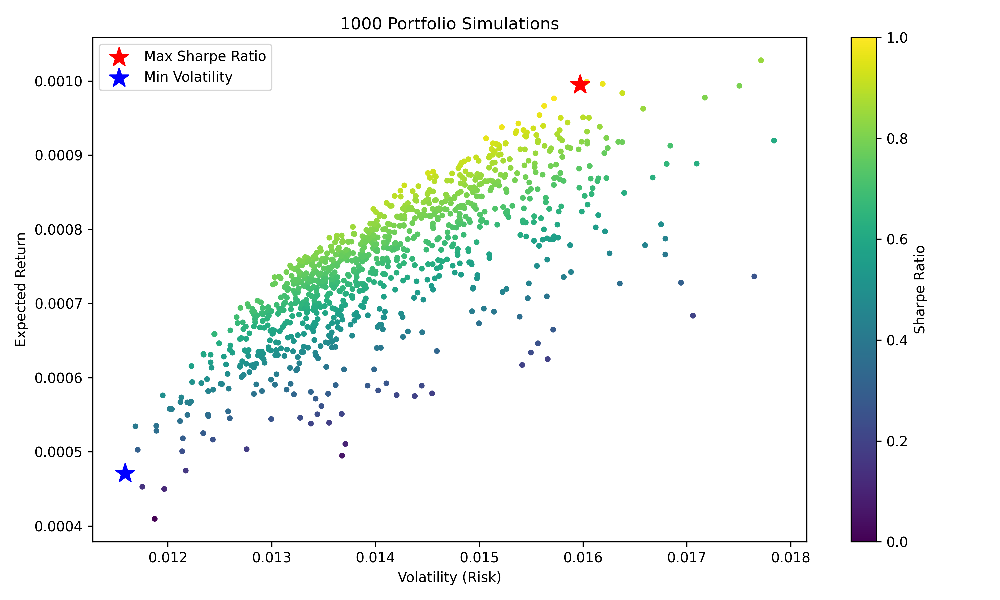

# 📈 Portfolio Optimization with YFinance and Python

This project demonstrates how to use Python to perform **portfolio optimization** on a set of stocks using historical price data. It includes:

- Downloading stock price data with `yfinance`
- Calculating daily returns, mean returns, and the covariance matrix
- Simulating 1,000 random portfolios to visualize the risk/return trade-off
- Optimizing the portfolio using **two methods**:
  - **Method 1**: Simulation-based (brute-force)
  - **Method 2**: SLSQP-based (constrained optimization using `scipy.optimize.minimize`)

---

## 🛠️ Technologies Used

- Python
- yfinance – for fetching historical stock data
- pandas and numpy – for data handling
- matplotlib – for plotting the results
- scipy.optimize – for portfolio optimization

---

## 📊 Stocks Used

This analysis includes the following tickers:

- Johnson & Johnson (`JNJ`)
- Amazon (`AMZN`)
- JPMorgan Chase (`JPM`)
- Apple (`AAPL`)
- Exxon Mobil (`XOM`)

Historical data is downloaded for the period from **2020-01-01** to **2024-12-31**.

---

# ⚙️ Method 1: Portfolio Simulation (Random Portfolios)

This approach:
- Randomly generates 1,000 portfolio weight combinations
- Calculates expected return, volatility, and Sharpe ratio for each
- Identifies:
  - 📍 **Max Sharpe Ratio Portfolio**
  - 📍 **Minimum Volatility Portfolio**

---

## 🔄 Workflow Overview

1. **Download Price Data**  
   Use `yfinance` to fetch historical closing prices.

2. **Calculate Daily Returns**  
   Compute daily percentage change.

3. **Estimate Statistics**  
   - Mean returns  
   - Covariance matrix

4. **Simulate 1,000 Portfolios**  
   - Random weight combinations  
   - Portfolio return, volatility, Sharpe ratio

5. **Visualize Efficient Frontier**  
   - Risk vs return plot  
   - Highlight max Sharpe and min volatility

---

## 📊 Visualization

This plot shows:

- 1,000 simulated portfolios, colored by Sharpe ratio  
- 🔴 Red star = Portfolio with **max Sharpe ratio**  
- 🔵 Blue star = Portfolio with **min volatility**



---

# ⚙️ Method 2: Portfolio Optimization with SLSQP

This approach:
- Uses `scipy.optimize.minimize` (Sequential Least Squares Programming)  
- Solves for **maximum Sharpe ratio** under realistic constraints

### Constraints:
- Portfolio weights must sum to 1  
- No stock may exceed 40% of the portfolio

---

## ✅ Sample Output

📌 Output from `scipy.optimize.minimize` (SLSQP method):

```
Optimized Portfolio Weights: [0.20, 0.15, 0.30, 0.25, 0.10]
Optimized Portfolio Return: 0.00091
Optimized Portfolio Volatility: 0.01345
```

---

## 👤 Real-World Use Case (Client-Style)

A client wants to allocate capital across 5 stocks (JNJ, AMZN, JPM, AAPL, XOM) with these goals:

- **Maximize risk-adjusted return (Sharpe ratio)**
- **Limit any single stock to ≤ 40% of the portfolio**
- **Keep the total investment sum to 100%**

This project uses `scipy.optimize.minimize` (SLSQP method) to:

- Apply these real-world constraints
- Find the optimal allocation
- Return exact weights, expected return, and volatility

📊 This approach is highly practical for asset managers and analysts building production-grade portfolios.

---

## 🚀 How to Run and Customize

### 1. Clone the repository

```bash
git clone https://github.com/ishtufinquant/portfolio-optimizer.git
cd portfolio-optimizer
```

### 2. Install dependencies

```bash
pip install yfinance pandas numpy matplotlib scipy
```

### 3. Run the script

```bash
python portfolio_optimization.py
```

📌 The script runs both the simulation and optimization methods with a clean `main()` function. Future versions will modularize the code and support CLI inputs.

---

## 🔧 TODO (Planned Improvements)

- Refactor into separate modules  
- Add input flexibility via CLI or config  
- Include unit tests  
- Add export to CSV/PDF

---

## 📁 File Overview

```
portfolio-optimizer/
├── portfolio_optimization.py     # Main script (initial version)
├── README.md                     # Project documentation
├── requirements.txt              # Dependencies
├── assets/
│   └── efficient_frontier.png    # Output plot (automatically generated)
```

---

## 📄 License

This project is licensed under the **MIT License**. You are free to use, modify, and distribute it.

